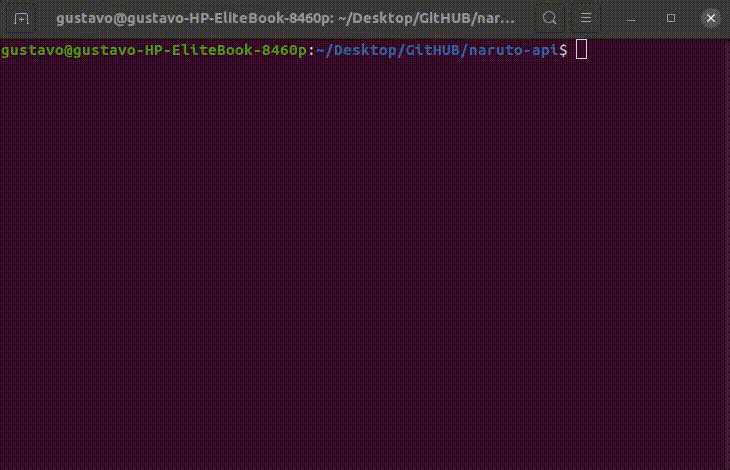

# HISOKA API NARUTO

Neste repositório, trago o código fonte de uma API Rest, que retornará em seus endpoints dados relacionados ao personagem do anime selecionado.
O objetivo deste repositório é ajudar a comunidade a se desenvolver , além de manter afiada minhas habilidades desenvolvendo usando a linguagem NodeJS.

## Versões

**04/09/2020**

- [ ] Endpoints especificos para cada um dos personagens.

- /narutouzumaki 04/09/2020 [x]
- /sasukeuchiha 04/09/2020 [x]
- /sakuraharuno 04/09/2020 [x]
- /kakashihatake 04/09/2020 [x]

- [x] Endpoint geral para todos os personagens.

## Ideias para possiveis atualizacoes 

- [ ] Armazenar os dados dos personagens em banco de dados.
- [ ] Adição de imagens também ao banco de dados.
- [ ] Adicionar a descricao de todos os usuarios.

## Como usar

- Após clonar o repositório, use o seguinte comando: $ npm install && node app.js , e faça suas requisições.

## Documentacao e explicacao da versao atual:
[Artigo Linkedin](#)

